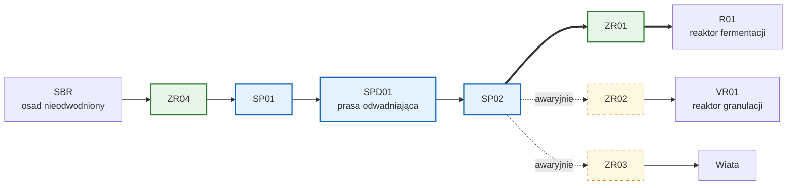
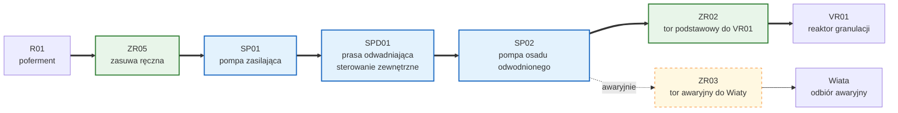
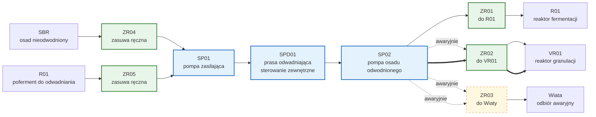
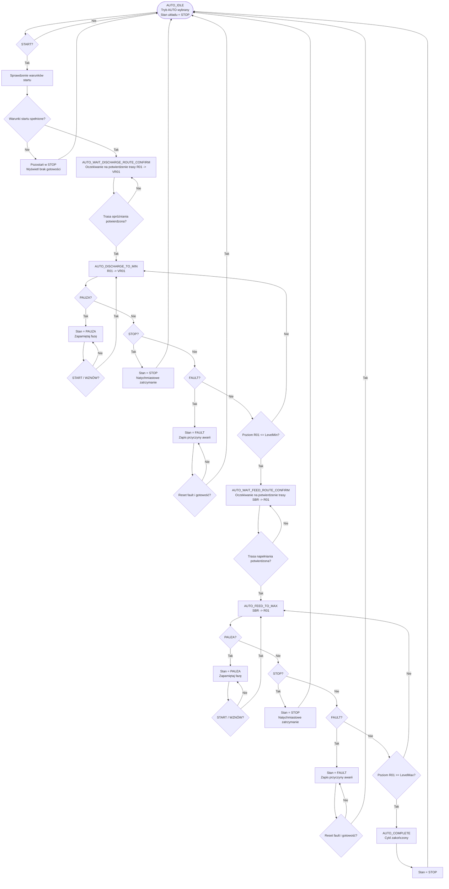
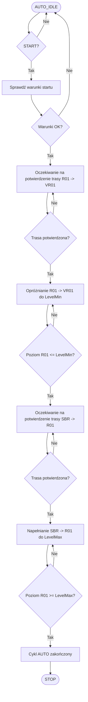

# 01 - Technologia procesu fermentacji odwodnionych osadów ściekowych i produkcji biogazu

Na mikrobiogazowni w Rybnie realizowany jest proces fermentacji beztlenowej odwodnionych osadów ściekowych, prowadzący do produkcji biogazu oraz nawozu z odwodnionego pofermentu.
Proces ten obejmuje kilka kluczowych etapów, od przygotowania osadów, przez fermentację, aż po odbiór wykorzystanie biogazu i produkcje nawozu.
Poniżej przedstawiamy szczegółowy opis technologii procesu.

## Cel dokumentu

Ten dokument opisuje warstwe technologiczna instalacji, bez detali implementacji PLC.

## Zakres procesu

- Odwadnianie osadu ściekowego z oczyszczalni w stacji odwadniania oraz odwadnianie pofermentu z fermentacji
- Fermentacja beztlenowa
- Linia biogazu (pomiar, oczyszczanie, pochodnia/odbiór)
- Kogeneracja (odbiór biogazu, produkcja energii elektrycznej i cieplnej)
- Obieg pofermentu i odwadnianie pofermentu
- Granulacja nawozu organicznego z odwodnionego pofermentu
- Wezel ciepla (obiegi grzewcze, wymienniki, pompy grundfos z zaworami trójdrożnymi mixit) ogrzewanie hali H01, ogrzewanie reaktora R01, schładzanie biogazu w wymienniku EX01

## Obiekty technologiczne (high-level)

- SDP01: stacja odwadniania odwadniania wraz z pompą SP01 :
  - osad ściekowy z oczyszczalni,
  - pofermentu z fermentacji
  - przełączanie strumienia (osad, poferment) realizowany jest ręcznie poprzez operatora. Odwodniony strumień transportowany jest za pomocą pompy śrubowej SP02 regulowanej falownikiem odpowiednio do; reaktora R01 lub stacji granulacji osadu VR01.
- R01: komora fermentacyjna
- GH01: zbiornik biogazu
- DS01: sekcja uzdatniania biogazu na filtrze z węgla aktywnego
- CHP01: kogenerator
- HC01: sprzęgło hydrauliczne rozdzielające obieg grzewczy kogeneratora od obiegu grzewczego procesu reaktor R01, chłodnicy C01, ogrzewania hali H01, osuszania biogazu w wymienniku EX01
- GA01: analizator biogazu
- TCH01: pochodni biogazu jako autonomicznego urządzenia zabezpieczającego przed nadmiernym ciśnieniem gazu lub obecnością zanieczyszczeń w biogazie
- BF01: przepływomierz biogazu
- Węzła granulacji nawozu organicznego z odwodnionego pofermentu w rektorze valoryzacji VR01 z wapnem CaO i perlitem, które są dozowane do VR01 odpowiednio z silosów S01 i S02 za pomocą podajników śrubowych.

## Przeplyw procesu

### 1. Główne założenia układu transportu osadu i pofermentu

Osad z oczyszczalni ścieków oraz poferment z reaktora fermentacji **R01** są obsługiwane przez tę samą linię odwadniania. Wspólnym elementem układu jest prasa pierścieniowa **SPD01** oraz pompa zasilająca **SP01**.

Proces technologiczny przebiega w dwóch podstawowych wariantach pracy:

- odwadnianie osadu ściekowego i kierowanie go do reaktora fermentacji **R01**,
- odwadnianie pofermentu z reaktora **R01** i kierowanie go do reaktora granulacji **VR01**.

Przełączenie pomiędzy tymi wariantami odbywa się przez ręczne przestawienie zasuw:

- **ZR01**
- **ZR02**
- **ZR03**
- **ZR04**

### 2. Opis funkcji zasuw

- **ZR01** - Zasuwa ustawia przepływ materiału po odwadnianiu w kierunku reaktora fermentacji **R01**.

- **ZR02** - Zasuwa ustawia przepływ materiału po odwadnianiu w kierunku reaktora granulacji **VR01**.

- **ZR03** - Zasuwa ustawia przepływ materiału w kierunku **Wiaty**.

- **ZR04** - Zasuwa ustawia dopływ osadu ściekowego z układu **SBR** oczyszczalni do prasy odwadniającej **SPD01** poprzez pompę **SP01**.

- **ZR05** - Zasuwa ustawia dopływ pofermentu z reaktora **R01** do prasy odwadniającej **SPD01** poprzez pompę **SP01**

### 3. Warianty pracy układu odwadniania

### 3.1. Tryby pracy układu odwadniania i transportu osadu/pofermentu

Układ odwadniania i transportu osadu/pofermentu może pracować w dwóch podstawowych trybach, które są definiowane przez ustawienie zasuw i kierunek przepływu materiału:

1. **Tryb podstawowy: SBR → SPD01 → R01**
2. **Tryb podstawowy: R01 → SPD01 → VR01**

### Tryb 1

W trybie 1 osad nieodwodniony doprowadzany jest z obiektu `SBR` przez ręczną zasuwę `ZR04` do pompy `SP01`, a następnie do prasy odwadniającej `SPD01`. Po odwodnieniu materiał odbierany jest przez pompę `SP02` i kierowany głównie do reaktora fermentacji `R01` przez zasuwę `ZR01`.

W sytuacjach awaryjnych materiał po odwodnieniu może zostać skierowany:

- do reaktora granulacji `VR01` przez `ZR02`,
- do `Wiaty` przez `ZR03`.

### **Diagram odwadnianie osadu z SBR i podawanie do R01**

### Tryb 2

W trybie 2 poferment z reaktora `R01` doprowadzany jest przez ręczną zasuwę `ZR05` do pompy `SP01`, a następnie do prasy odwadniającej `SPD01`. Po odwodnieniu materiał odbierany jest przez pompę `SP02` i kierowany głównie do reaktora granulacji `VR01` przez zasuwę `ZR02`.

- W sytuacjach awaryjnych materiał po odwodnieniu może zostać skierowany do `Wiaty` przez `ZR03`.

### **Diagram odwadnianie pofermentu z R01 i podawanie do VR01**

### **Diagram przepływu materiału dla obu trybów**

Aktywny tor przepływu:
`SBR -> ZR04 -> SP01 -> SPD01 -> SP02 -> ZR01 -> R01`

Wymagane ustawienie zasuw:

- **ZR04** — otwarcie dopływu osadu ściekowego z SBR,
- **ZR01** — ustawienie odbioru materiału do reaktora **R01**.

### 3.2. Odwadnianie pofermentu i dozowanie do reaktora granulacji **VR01**

W tym wariancie poferment z reaktora fermentacji **R01** kierowany jest do prasy odwadniającej **SPD01**, a po odwodnieniu trafia do reaktora granulacji **VR01**.

Aktywny tor przepływu:
`R01 -> ZR03 -> SP01 -> SPD01 -> ZR02 -> VR01`

Wymagane ustawienie zasuw:

- **ZR03** — otwarcie dopływu pofermentu z reaktora **R01**,
- **ZR02** — ustawienie odbioru materiału do reaktora **VR01**.

### 3.3.Wniosek technologiczny

Linia z prasą pierścieniową **SPD01** oraz pompą **SP01** jest wspólna dla obu operacji technologicznych. Oznacza to, że układ nie może jednocześnie:

- odwadniać osadu ściekowego i podawać go do **R01**,
- oraz odwadniać pofermentu z **R01** i podawać go do **VR01**.

W danym momencie aktywny może być tylko jeden wariant pracy układu, zależnie od ręcznego ustawienia zasuw.

### 3.4.Strategia sterowania

Strategia sterowania pracą instalacji fermentacji i produkcji nawozów polega na samoczynnym utrzymywaniu zadanego poziomu masy fermentacyjnej w reaktorze R01 poprzez naprzemienne realizowanie dwóch podstawowych operacji:

- odwadnianie osadu ściekowego z oczyszczalni i kierowanie go do reaktora fermentacji R01,
- odwadnianie pofermentu z reaktora R01 i kierowanie go do reaktora granulacji VR01.

#### 3.4.1 Tryby pracy nadrzędnego sterowania procesu

Nadrzędny system sterowania będzie umożliwiał operatorowi wybór trybu pracy układu odwadniania i transportu materiału, który będzie definiował aktywny tor przepływu. Dostępne będą dwa główne tryby:

##### **Tryb Auto**

Tryb automatyczny służy do samoczynnego utrzymywania poziomu materiału w reaktorze fermentacji `R01` w zadanym zakresie roboczym.

W trybie tym układ realizuje naprzemiennie:

- odwadnianie pofermentu z reaktora `R01` i kierowanie odwodnionego materiału do reaktora granulacji `VR01`,
- dozowanie odwodnionego substratu z `SBR` do reaktora `R01`.

Przełączanie pomiędzy fazą opróżniania i napełniania odbywa się automatycznie na podstawie poziomu materiału w reaktorze `R01` oraz zadanych progów sterowania. Przed fazą opróżniania i napełniania wymagane jest potwierdzenie położenia zasuw ręcznych. **Bez potwierdzenia prawidłowego położenia system nie uruchomi się samoczynnie i nie przejdzie do kolejnej fazy**. Tryb automatyczny realizuje pełny standardowy cykl pracy układu w stałej kolejności technologicznej.

Cykl automatyczny przebiega według następującego schematu:

1. odwadnianie pofermentu z reaktora `R01` i kierowanie materiału do `VR01` aż do osiągnięcia minimalnego poziomu roboczego w `R01`,
2. zapamiętanie wielkości obniżenia poziomu w `R01`,
3. odwadnianie osadu z `SBR` i podawanie materiału do `R01` aż do ponownego osiągnięcia górnego poziomu roboczego,
4. zakończenie cyklu automatycznego.

Tryb AUTO nie realizuje wyboru rodzaju operacji. Zawsze wykonuje pełny cykl obejmujący:

- opróżnianie `R01 -> VR01`,
- następnie napełnianie `SBR -> R01`.

Operacje wymuszone, awaryjne lub niepełne realizowane są wyłącznie w trybie `MANUAL`.

Po zakończeniu pełnego cyklu układ automatycznie przechodzi do stanu `STOP`. Każdy kolejny cykl automatyczny wymaga ponownego wydania polecenia `START` przez operatora.

Tryb AUTO — logika działania

Tryb AUTO realizuje jeden pełny cykl pracy instalacji, uruchamiany przez operatora poleceniem `START`.

Cykl obejmuje następujące etapy:

1. sprawdzenie warunków startu,
2. oczekiwanie na potwierdzenie trasy opróżniania `R01 -> VR01`,
3. odwadnianie pofermentu z `R01` do osiągnięcia poziomu `MIN`,
4. oczekiwanie na potwierdzenie trasy napełniania `SBR -> R01`,
5. odwadnianie osadu z `SBR` do osiągnięcia poziomu `MAX`,
6. zakończenie cyklu i przejście układu do stanu `STOP`.

W czasie pracy cykl może zostać:

- wstrzymany poleceniem `PAUZA`,
- zatrzymany poleceniem `STOP`,
- przerwany przez stan `FAULT`.
  
## Flowchart trybu AUTO

Flowchart trybu AUTO — wersja uproszczona

### Tryb Manual

Tryb ręczny umożliwia operatorowi wybór pojedynczej operacji technologicznej bez realizacji pełnego automatycznego cyklu utrzymywania poziomu w reaktorze `R01`.

W trybie ręcznym operator może wybrać jedną z następujących operacji:

- karmienie reaktora: `SBR -> R01`,
- produkcja nawozu: `R01 -> VR01`,
- ewakuacja osadu do Wiaty: `SBR -> Wiata`,
- ewakuacja pofermentu do Wiaty: `R01 -> Wiata`.

### Sekwencja pracy instalacji oraz nadrzędna logika procesu SCADA

1. Odwadnione osady w stacji odwadniania SPD01, która jest urządzeniem autonomicznym z wlasnym sterowaniem są transprtowane do rekatora fermentacjhi R01 za pomocą pompy SP02.
2. W reaktrorze R01 odbywa się proces fermentacji w wyniku którego powstaje biogaz. Proces odbywa się w warunkach mezofilowych regulowana temperatura 37 stopni Celsjusza. Monitorowane są takie parametry jak ph ph01, temperatura T01, poziom L01, ciśnienie P01. Temperatura regulowana jest w sposób dwustanowy obiegiem grzewczym z sprzęgła hydraulicznego HC01 kontrolowanym przez Mixit grundfos MX02. Substraty są mieszane w reaktorze R01 za pomocą dwóch mieszadeł MX01 i MX02 które działają naprzemienni. Napędy mieszadeł są realizowane za pomocą styczników (MX01) i (MX02)
3. Powstajacy w R01 gaz jest transportowany do GH01 na zasadzie naczyń połączonych i magazynowa w zbiorniku GH01, gdzie monitorowane jest cisnienie gazu. Zbiornik GH01 jest wyposażony w zawór bezpieczeństwa SV01, który otwiera się przy przekroczeniu cisnienia 5.5kPa. Natomiast pochodnia załączać się przy ciśnieniu 5.2kPa i zbija ciśnienie do bezpiecznego poziomu.
4. Biogaz z GH01 następnie jest kondycjonowany przez schłodzenie w wymienniku ziemnym a następnie podgrzany w wymienniku EX01 zasilanym z obiegu grzewczego HC01 i regulowanym Mixit MX03.
5. Odwodniony biogaz jest anstępnie oczyszczany w filtrze DS01 na węglu aktywnym gdzie usuwane są związki siarki, siloksany i inne zanieczyszczenia. Oczyszczony biogaz jest następnie analizowany w GA01, gdzie monitorowane są takie parametry jak: zawartość metanu, zawartość tlenu, zawartość dwutlenku węgla i parametry opałowe. za analizatorem umiejscowiony jest przepływomierz F01, który nadaje impulsy w zalezności od przeplywu. Na podstawie impulsów i ich wag wyliczana jest ilość biogazu oraz przepływ w PLC
6. Kogeneracja realizowana jest w małym 10KWe kogeneratorze gdzie cieplo jest wprowadzana do sprzegła hydraulicznego natomiast energia elektryczna przez falownik fotowoltaiczny wypychaa do sieci (odbiór biogazu, produkcja energii elektrycznej i cieplnej)
7. Granulacja nawozu organicznego z odwodnionego pofermentu jest realizowana w rektorze valoryzacji VR01 z wapnem CaO i perlitem, które są dozowane do VR01 odpowiednio z silosów S01 i S02 za pomocą podajników śrubowych z napedami M01 i M02 oraz elektrowibratoremi E01 i E02 wspomagajacymi grawitacyjnie opadanie materiału do słimaka podajacego.Granulator valoryzacji VR01 jest posadowiony na tensometrach i polaczone z przetwornikiem SIMEX z któreg sygnał jest przesyłany po MODBUS sterownika PLC w którym nastepnie w programie realizowane jest odmierzanie dawek wapna perlitu i osadu. Proces mieszania w VR01 odbywa się za pomocą dwóch mieszadeł napędzanych napędami M01 i M02, które są sprzężone mechanicznie. W celu równej pracy mieszadeł na wspólne obciążenie momentem falowniki sterujace napędami pracują w trybie równoważenia momentu aby jeden lub drugi nie przechodził w pracę generatorową (sposób ustawienia opisany w dokumentacji falownika ATV320).  Mieszanina wapna z osadem i perlitem daje sypka strukturę materiału nawozowego.Proporcje dozowania są ustawione w ten sposób, że osad stanowi 65% udziału masowego o srednim uwodnieniu około 17% dozowane perlit około 25%, a wapno około 10% co zapewnia optymalny sklad. Granulat jest następnie transportowany grawitacyjnie do big bag przez otwracie klapy zrzutowej w granulatorze, której poziom otwarcia jest od zera do 120 stopni i jest regulowany przez napęd elektryczny z enkoderem. Poziom otwarcia można regulować od 0 do 100% z dokładnością do 3%, co pozwala na precyzyjne dozowanie granulat do big bag. Granulacja nawozu organicznego z odwodnionego pofermentu jest kluczowym etapem procesu, który pozwala na produkcję wysokiej jakości nawozu organicznego, który może być wykorzystywany w rolnictwie jako naturalny nawóz, przyczyniając się do zrównoważonego rozwoju i ochrony środowiska.
8. Pochodnia biogazu (TCH01) – jest urządzeniem zabezpieczającym, które jest uruchamiane w przypadku wykrycia niebezpiecznych warunków, takich jak nadmierne ciśnienie gazu lub obecność zanieczyszczeń. Pochodnia jest wyposażona w palnik, który spala nadmiar biogazu, aby zapobiec potencjalnym zagrożeniom. Sterowanie pochodnią odbywa się poprzez sygnał o ciśnieniu biogazu na rurociągu przed pochodnią. Instalacja pochodni monitoruje ciśnienie gazu i w razie potrzeby uruchamia pochodnię, aby spalić nadmiar biogazu i utrzymać bezpieczne warunki pracy instalacji. Pochodnia jest kluczowym elementem systemu bezpieczeństwa, który chroni przed potencjalnymi zagrożeniami związanymi z nadmiernym ciśnieniem gazu lub obecnością zanieczyszczeń w biogazie. Pochodnia jest wyposażona w autonomiczny uklad sterowania oparty na sterowniku CX7080 z rodziny Beckhoff i wymienia dane ze sterownikiem głównym CX9020 za pomocą protokołu ADS. Pochodnia może pracować w trybie automatycznym, gdzie jest uruchamiana przez sygnał z PLC głównego, lub w trybie ręcznym, gdzie operator może ręcznie uruchomić pochodnię w przypadku wykrycia niebezpiecznych warunków.
9. Węzęł ciepla służy do zasilania w energię cieplną urządzeń procesowych oraz obiektów technologicznych. Węzeł cieplny jest wyposażony w wymienniki ciepła, pompy i zawory, które umożliwiają kontrolę przepływu i temperatury medium grzewczego. Węzeł cieplny jest zasilany ciepłem z kogeneratora CHP01, który wykorzystuje biogaz do produkcji energii cieplnej. Węzeł cieplny jest kluczowym elementem systemu grzewczego, który zapewnia odpowiednie warunki temperaturowe dla procesu fermentacji oraz innych procesów technologicznych w instalacji. Sterowanie węzłem cieplnym odbywa się poprzez system automatyki oparty na elektronicznych zaworach trójdrożnych Mixit firmy Grundfos lub pompę grundfoss obiegową. W instalacji zawory Mixit zasilają w ciepło reaktor R01 gdzie zastosowano regulacje dwustanową, zasilają halę H01 w ciepło oraz wymiennik osuszacza biogazu EX01. Układ rozpraszania ciepła do otoczenia przy nadmiernym wzroscie temperatury jest natomiast zrealizowany za pomoca dmuchawy naviewnej Volcano C01, która jest zasilana w ciepło za pomocą pompy obiegowej grundfos sterowanej z PLC poprzez przekaźnik interfejsowy. Dodatkowo sterowane jest wyjście wentylatora tej chłodnicy również wyjściem z PLC poprzez przekaźnik interfejsowy K304. Temperatura w R01 jest regulowana dwustanowo za pomocą algorytmu sterownika PLC w bloku funkcyjnym FB_Mixit tam gdzie wymagana jest regulacja temperatury np. temperatury w komorze fermentacji **ogrzewanie**  R01 obieg z MIxit MX01 lub tam gdzie rozpraszana jest energia do otoczenia **chłodzenie** poprzez chłodnice C01-obieg Mixit MX02 z przekaźnikiem interfejsowym. Z węzła cieplnego zasilany jest również wymiennik EX01 który jest zasilany w sposob ciągły aby podgrzac biogaz po schłodzeniu i obniżyc wilgotność względna RH-obieg MIXIT MX03. Wymiennik ten służy do schładzania biogazu przed jego oczyszczeniem w filtrze DS01. Następny obieg MX4 służy do podgrzewanie hali H01 za pomocą nagrzewnicy powietrza Volcano zamontowanej w hali H01-Obieg Mixit MX04. Nagrzewnica skłąda się z obiegu ciepła zasilanego z Mixit oraz wentylatora uruchamianego przekaźnikiem interfejsowym uruchamianym z PLC. Wentylator jest uruchamiany przekaźnikiem K303.

10. Monitorowanie i sterowanie całym procesem przez SCADA (Promotic) na IP BOX NANO z win 11 ltsc IOT enterprise z komunikacją OPC UA do PLC CX9020 (TwinCAT 3). Sterowanie procesem odbywa się poprzez SCADA promotic, która umożliwia operatorom monitorowanie parametrów procesu, takich jak temperatura, ciśnienie, poziom i przepływ, oraz sterowanie urządzeniami, takimi jak pompy, mieszadła i pochodnia. SCADA jest kluczowym elementem systemu automatyki, który pozwala na efektywne zarządzanie procesem fermentacji i produkcji biogazu, zapewniając jednocześnie bezpieczeństwo i optymalizację pracy instalacji. SCADA promotic została zainstalowana na komputerze IP BOX NANO bezwentylatorowym jako aplikacja typu kiosk z systemem Windows 11 LTSC IoT Enterprise, co zapewnia stabilność i niezawodność działania systemu wizualizacji. Komunikacja między SCADA a PLC odbywa się za pomocą protokołu OPC UA, co umożliwia szybki i bezpieczny transfer danych oraz sterowanie urządzeniami w czasie rzeczywistym. SCADA promotic jest również wyposażona w funkcje alarmowe i zdarzeniowe, które pozwalają na szybkie reagowanie na potencjalne problemy i awarie w procesie, co jest kluczowe dla zapewnienia bezpieczeństwa i ciągłości pracy instalacji. Komunikacja między urzadzeniami odbywa się po sieci ethernet, która została wytworzona poprzez urządzenie IXON sprzętowy VPN, który tworzy odizolowaną podsieć dla systemu automatyki mikrobiogazowni 192.168.140.1/24. W tej podsieci pracują głowny plc CX9020 na ktorym jest program sterujacy oraz server OPCUA IP 192.168.140.102, sterownik pochodni CX7080 sterujący pochodnia i wymieniajacy dane z głownym PLC oraz komputer z SCADA IPBOX Nano 192.168.140.101, który nie ejst pingowalny poprzez ustawienia win 11 iot domyślne (nie zmienialem tego). Ekrany synoptyczne są na dwóch monitorach jeden w psotaci telewizora tlc 50cali w 4k a drugi na monitorze 27 tez w 4k. Jeden ekran przedstawia głowne parametry procesowe w widoku 3d drugi przedstawia schemat procesowy.

## Parametry krytyczne procesu

- Temperatura fermentacji T01: 36-38°C (mezofilowa)
- pH medium ph01: 6.5-7.5
- Cisnienie gazu P01: <5.0kPa (bezpieczne), >5.5kPa (otwarcie zaworu SV01 mechanicznego), uruchomienie pochodni TCH01
- Poziom medium: L01: 2.6-2.8m (poziom krytyczny 2.9m - alarm)
- Przeplyw biogazu: F01: <1m3/h> - <3m3/h (maksymalna wydajność instalacji)>

## Stany operacyjne procesu

- Praca automatyczna
- Praca reczna (serwis)
- Postoj kontrolowany
- Alarm / awaria

## Alarmy technologiczne (grupy)

- Bezpieczenstwo procesowe (cisnienie, gaz)
- Jakosc procesu (temperatura, pH, stężenie CH4, stężenie H2S)
- Dostepnosc urzadzen (mieszadla, pochodnia, analizator, przepływomierz, kogenerator, reaktor granulacji)

## Otwarte punkty do uzupelnienia

- Granice alarmowe i histerezy dla kazdego parametru
- Dokladny opis sekwencji rozruchu i zatrzymania
- Powiazanie obiektow z P&ID / draw.io
